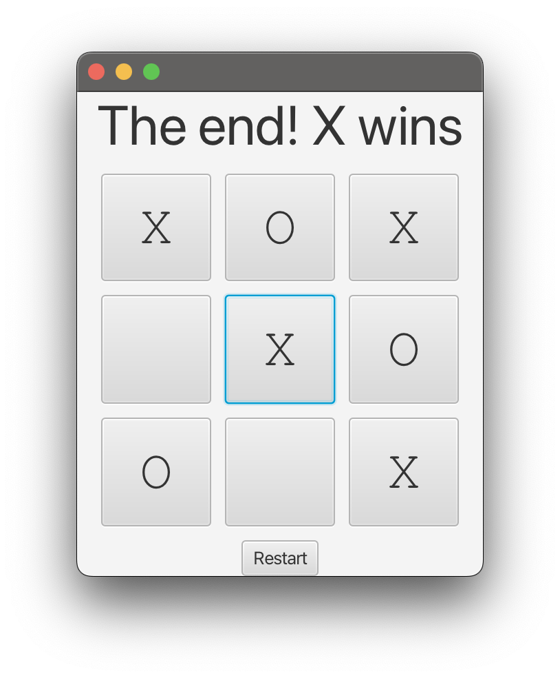

# Tic Tac Toe (Java)

A JavaFX Tic-Tac-Toe game built in Java, featuring interactive gameplay, win detection, turn management, and restart functionality.

## Features
- Two-player gameplay
- Win and draw detection
- Input validation for user moves

## What I learned
- Java control flow and logic building
- Problem solving through game design
- Structuring simple backend-style logic in Java
